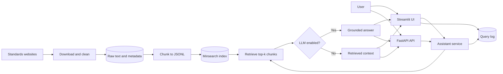

# Precision Oncology Data Architect Assistant

An LLM/RAG-powered assistant for oncology and genomics data modeling using
modern healthcare standards:

- FHIR R4
- US Core
- mCODE
- Genomics Reporting Implementation Guide

The assistant helps healthcare data architects, informaticians, researchers,
and developers understand how oncology and genomics data should be represented,
modeled, and exchanged.

## Scope

This project focuses on:

- oncology data modeling
- FHIR resource selection
- mCODE profile guidance
- molecular report representation
- genomics reporting architecture
- sample FHIR resource and bundle design

It does not provide:

- clinical treatment recommendations
- variant pathogenicity interpretation
- clinical trial matching
- treatment decision support

## Architecture

The active application uses an offline ingestion pipeline and a lightweight
runtime RAG pipeline. Canonical FHIR R4, US Core, mCODE, and Genomics Reporting
pages are downloaded from a manifest, converted to clean text, split into
overlapping JSONL chunks, and indexed with Minsearch. At runtime, the FastAPI
entrypoint, Streamlit UI, and reusable Python service retrieve top-ranked
chunks and either return them directly or pass them to the configured Groq,
OpenRouter, or OpenAI model. Queries and user feedback are recorded in a local
append-only JSONL log.



A separate legacy/experimental path supports parsing FHIR JSON bundles,
embedding typed chunks, and storing them in ChromaDB. That path is not used by
the current Streamlit or FastAPI runtime.

See [docs/architecture.md](docs/architecture.md) for the complete project,
module dependency, data flow, folder structure, and query sequence diagrams.

## Repository Structure

```text
app/                  FastAPI entrypoint and Streamlit UI
src/ingestion/         download and chunk documents
src/retrieval/         build and query the search index
src/rag/               LLM answer pipeline
src/api/               reusable service interface
evaluation/            evaluation questions and scripts
monitoring/            local query and feedback logging
docs/                  project documentation
data/                  raw, processed, and indexed data
```

## Local Setup

Python 3.10 is the supported baseline.

```bash
python -m venv .venv
source .venv/bin/activate
python -m pip install --upgrade pip
pip install -r requirements.txt
cp .env.example .env
```

Build or refresh the local retrieval index:

```bash
python -m src.ingestion.download_sources
python -m src.ingestion.ingest_documents
python -m ingestion.index_to_vectordb
```

If `data/raw/` and `data/processed/chunks.jsonl` already exist, the shorter
index refresh is enough:

```bash
python -m ingestion.index_to_vectordb
```

## Run

Start the FastAPI service:

```bash
uvicorn app.api:app --host 0.0.0.0 --port 8000
```

Start the Streamlit app:

```bash
streamlit run app/streamlit_app.py
```

Useful API endpoints:

- `GET /health`
- `POST /search`
- `POST /answer`

Example API request body:

```json
{
  "query": "How should EGFR Exon19del be represented in mCODE?",
  "num_results": 5,
  "use_llm": false
}
```

## RAG Answer Mode

The app can run in retrieval-only mode without an LLM key. To enable generated
answers, create `.env` from `.env.example` and set the provider-specific key,
for example:

```text
LLM_PROVIDER=openai
OPENAI_API_KEY=your_key_here
OPENAI_MODEL=gpt-4o-mini
```

Supported providers in the active RAG pipeline are `groq`, `openrouter`, and
`openai`.

## Evaluation

Retrieval evaluation with evidence IDs:

```bash
python -m evaluation.retrieval_eval \
  --questions data/evaluation/questions.jsonl \
  --results artifacts/retrieval_results.jsonl \
  --k 5
```

Answer-quality smoke evaluation from the CSV fixture:

```bash
python evaluation/llm_eval.py --limit 5
```

The copied `evaluation/ground_truth.csv` and `evaluation/questions.csv` provide
starter questions and expected-source labels. Treat those as smoke-test assets,
not final quality claims.

## Monitoring

Queries and feedback are logged locally to:

```text
logs/queries.jsonl
```

## Docker

```bash
docker compose build
docker compose up
```

The API is exposed at `http://localhost:8000` and Streamlit at
`http://localhost:8501`.

## Quality Gates

Before opening a final capstone PR:

```bash
python -m pytest -q
python -m compileall -q app evaluation ingestion monitoring src tests
docker compose config
docker compose build
```

Required release behavior:

- citations resolve to retrieved chunk IDs;
- unsupported questions abstain;
- repeated ingestion does not create duplicates;
- no real PHI or secrets are committed;
- CI runs tests rather than commenting them out;
- README commands match the actual implementation.

See [docs/course_requirements.md](docs/course_requirements.md),
[docs/evaluation.md](docs/evaluation.md), and
[docs/clawbio_integration.md](docs/clawbio_integration.md) for more detail.
