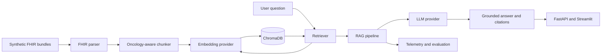

# Precision Oncology Data Architect Assistant

A Zoomcamp capstone project for turning synthetic oncology FHIR R4 bundles into
searchable evidence and citation-grounded answers.

> **Migration status:** the repository scaffold is being integrated with a
> separate local core implementation. The core contains FHIR parsing, chunking,
> embedding, ChromaDB, retrieval, prompt loading, and multi-provider LLM
> adapters. API, UI, evaluation execution, monitoring, and deployment remain
> integration work until their pull requests are merged and verified.

## Intended users

- Healthcare data architects working with FHIR, mCODE, and genomics data
- Engineers prototyping oncology retrieval-augmented generation
- Zoomcamp reviewers evaluating ingestion, retrieval, RAG, evaluation,
  monitoring, UI, and reproducibility

This is an educational prototype. It is not a medical device and must not be
used for diagnosis, treatment selection, or patient-care decisions.

## Architecture



The target flow is:

1. Validate and parse synthetic FHIR bundles.
2. Convert resources into traceable oncology documents.
3. Chunk documents while preserving source metadata.
4. Generate embeddings and upsert stable chunk IDs into ChromaDB.
5. Retrieve and rerank evidence for a question.
6. Generate an answer constrained to retrieved evidence.
7. Return citations or abstain when evidence is insufficient.
8. Record latency, retrieval results, model usage, and feedback.

## Capability status

| Capability | Status |
|---|---|
| FHIR parsing and oncology metadata extraction | Implemented in local core; migration review required |
| Recursive and sentence-aware chunking | Implemented in local core; tests required |
| Local/OpenAI embeddings | Implemented in local core; provider-name defect must be fixed |
| ChromaDB storage | Implemented in local core; idempotency and score semantics must be fixed |
| Retrieval and keyword reranking | Implemented in local core; interface defect must be fixed |
| Multi-provider LLM clients | Implemented in local core; live-provider tests are intentionally excluded |
| RAG orchestration | Not implemented |
| FastAPI and Streamlit | Not implemented |
| Automated retrieval/RAG evaluation | Framework started; labeled evidence IDs still required |
| Monitoring | Not implemented |
| Docker deployment | Configuration prepared; blocked on runnable API |

See [the maintainer migration plan](docs/MAINTAINER_MIGRATION_PLAN.md) and the
[capstone upgrade report](docs/CAPSTONE_UPGRADE_REPORT.md) for the detailed
file classification and delivery roadmap.

## Repository layout

```text
app/          FastAPI, RAG orchestration, and Streamlit entry points
data/         Synthetic FHIR fixtures and versioned evaluation records
docs/         Architecture, migration, and capstone planning
evaluation/   Deterministic retrieval and answer-quality evaluation
ingestion/    Command-line indexing entry point
monitoring/   Structured telemetry and feedback
prompts/      Versioned system prompts
src/          Reusable parser, chunker, retrieval, and provider code
tests/        Unit and integration tests
```

## Local setup

Python 3.10 is the supported baseline.

```bash
python -m venv .venv
source .venv/bin/activate
python -m pip install --upgrade pip
pip install -r requirements.txt
cp .env.example .env
```

After the core migration and provider fixes:

```bash
python -m ingestion.index_to_vectordb
uvicorn app.api:app --host 0.0.0.0 --port 8000
streamlit run app/streamlit_app.py
```

Do not present these commands as release-ready until CI executes them
successfully from a clean checkout.

## Docker

```bash
docker compose build
docker compose up
```

The API should be available at `http://localhost:8000` and Streamlit at
`http://localhost:8501` once the application entry points are implemented.

## Evaluation

The evaluation framework expects:

- a JSONL ground-truth file containing `id` and `relevant_chunk_ids`;
- a JSONL retrieval run containing `id` and ranked `retrieved_chunk_ids`.

```bash
python -m evaluation.retrieval_eval \
  --questions data/evaluation/questions.jsonl \
  --results artifacts/retrieval_results.jsonl \
  --k 5
```

It reports Recall@k, mean reciprocal rank, and nDCG@k overall and by category.
The existing keyword-only NSCLC questions should be migrated to evidence-ID
labels before they are used for quality claims.

## Quality gates

Before opening the final capstone PR:

```bash
python -m pytest -q
python -m compileall -q app evaluation ingestion monitoring src tests
docker compose config
docker compose build
```

Required release behavior:

- citations resolve to retrieved chunk IDs;
- unsupported questions abstain;
- repeated ingestion does not create duplicates;
- no real PHI or secrets are committed;
- CI runs tests rather than commenting them out;
- README commands match the actual implementation.
