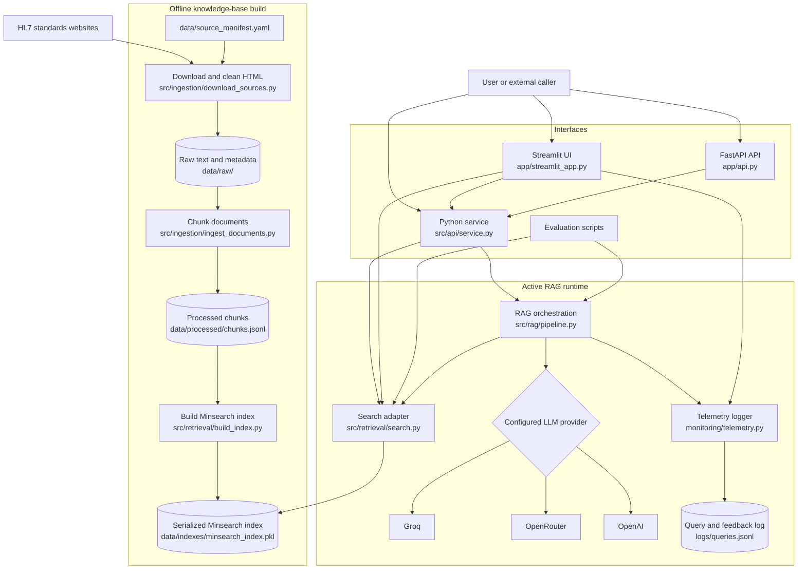
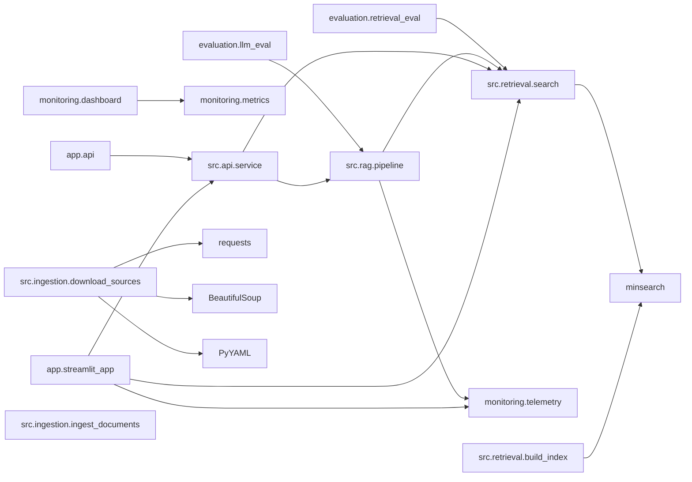
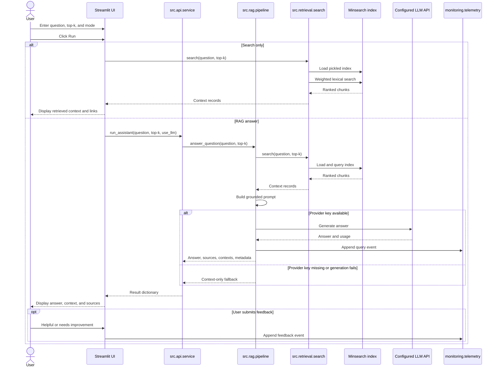

# Project Architecture

## Architectural Overview

The Precision Oncology Data Architect Assistant is a retrieval-augmented
generation application for questions about FHIR R4, US Core, mCODE, and the
Genomics Reporting Implementation Guide.

The active application uses a lightweight local retrieval pipeline:

1. `data/source_manifest.yaml` identifies canonical public standards pages.
2. `src/ingestion/download_sources.py` downloads and cleans those pages.
3. `src/ingestion/ingest_documents.py` splits clean text into JSONL chunks.
4. `src/retrieval/build_index.py` builds a serialized Minsearch index.
5. `app/api.py`, `app/streamlit_app.py`, and `src/api/service.py` retrieve
   relevant chunks through `src/retrieval/search.py`.
6. `src/rag/pipeline.py` either returns retrieved context directly or sends
   grounded context to the configured Groq, OpenRouter, or OpenAI model.
7. `monitoring/telemetry.py` appends query and feedback events to local JSONL
   logs for review in `monitoring/dashboard.py`.

## 1. Project Architecture Diagram



## 2. Module Dependency Diagram

Solid arrows represent Python imports or direct calls in the current
application.



## 3. Data Flow Diagram

```mermaid
flowchart LR
    subgraph BuildTime["Offline knowledge-base build"]
        A[Canonical source URLs<br/>source_manifest.yaml]
        B[HTTP download]
        C[Raw HTML]
        D[Clean plain text]
        E[Source metadata]
        F[Overlapping text chunks]
        G[JSONL chunk records]
        H[Minsearch fit]
        I[(Pickled search index)]

        A --> B
        B --> C
        C --> D
        B --> E
        D --> F
        E --> G
        F --> G
        G --> H
        H --> I
    end

    subgraph QueryTime["Runtime query flow"]
        Q[User question]
        Mode{Selected mode}
        Retrieve[Weighted lexical search<br/>source_name 2.5, content 1.0]
        Context[Top-k context chunks and source metadata]
        Key{LLM key available?}
        Prompt[System prompt + context + question]
        Generate[Provider LLM generation]
        Fallback[Context-only fallback]
        Result[Answer, contexts, sources,<br/>provider, model, usage]
        Display[Streamlit rendering or API response]
        QueryLog[(Query telemetry)]
        Feedback[Helpful / needs improvement]
        FeedbackLog[(Feedback telemetry)]

        Q --> Mode
        Mode -->|Search only| Retrieve
        Mode -->|RAG answer| Retrieve
        I --> Retrieve
        Q --> Retrieve
        Retrieve --> Context
        Context -->|Search only| Display
        Context --> Key
        Key -->|Yes| Prompt
        Q --> Prompt
        Prompt --> Generate
        Generate --> Result
        Key -->|No or generation error| Fallback
        Context --> Fallback
        Fallback --> Result
        Result --> Display
        Generate --> QueryLog
        Display --> Feedback
        Feedback --> FeedbackLog
    end
```



## 4. Principal Data Contracts

| Artifact | Format | Producer | Consumer |
|---|---|---|---|
| `data/source_manifest.yaml` | YAML collections and source URLs | Maintainer | Source downloader |
| `data/raw/<collection>/*` | HTML, clean text, metadata JSON | Source downloader | Document ingestion |
| `data/processed/chunks.jsonl` | One searchable chunk per JSON line | Document ingestion | Index builder |
| `data/indexes/minsearch_index.pkl` | Pickled Minsearch index | Index builder | Runtime search |
| RAG result | Python dictionary | RAG pipeline | Service, API, and Streamlit UI |
| `logs/queries.jsonl` | Append-only JSON events | Telemetry module | Monitoring dashboard |

## 5. Folder Structure

Generated data and index files are intentionally excluded from git and can be
rebuilt from the public source manifest.

```text
.
├── app/
│   ├── api.py                         # FastAPI endpoints
│   └── streamlit_app.py               # Interactive UI and feedback controls
├── artifacts/
│   ├── retrieval_metrics.json         # Latest retrieval metric output
│   └── retrieval_strategy_comparison.json
├── data/
│   └── source_manifest.yaml           # Public standards source manifest
├── docs/
│   ├── architecture.md
│   ├── course_requirements.md
│   ├── data_sources.md
│   ├── evaluation.md
│   ├── monitoring.md
│   ├── REVIEWER_EVALUATION_GUIDE.md
│   └── rubric_scorecard.md
├── evaluation/
│   ├── ground_truth.csv
│   ├── llm_eval.py
│   ├── questions.csv
│   └── retrieval_eval.py
├── ingestion/
│   └── index_to_vectordb.py           # Compatibility entrypoint for index build
├── monitoring/
│   ├── dashboard.py
│   ├── metrics.py
│   └── telemetry.py
├── src/
│   ├── api/service.py                 # Stable application-facing interface
│   ├── ingestion/download_sources.py  # Manifest-driven downloader and cleaner
│   ├── ingestion/ingest_documents.py  # Active text chunking pipeline
│   ├── rag/pipeline.py                # Active RAG and provider routing
│   └── retrieval/
│       ├── build_index.py             # Active Minsearch index builder
│       └── search.py                  # Active runtime retrieval
├── tests/
├── Dockerfile
├── docker-compose.yml
├── Makefile
├── README.md
└── requirements.txt
```

## 6. User Query Sequence



## Implementation Notes

- The active retriever is lexical Minsearch.
- The active retrieval strategy is `expanded`, which adds domain query expansion,
  source-name boosting, and collection diversification.
- The active RAG provider router supports `groq`, `openrouter`, and `openai`.
- The Streamlit UI explicitly detects keys for all three active providers.
- `run_assistant(..., use_llm=None)` auto-enables generation when the selected
  provider has its required key configured.
- Runtime search reloads the pickled index for each search call.
- Successful LLM generations are logged; context-only fallbacks are not logged
  as query events by the RAG pipeline.
- `ingestion/index_to_vectordb.py` is kept as a compatibility entrypoint for
  the documented index-build command.
