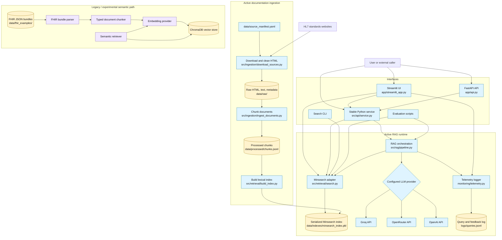
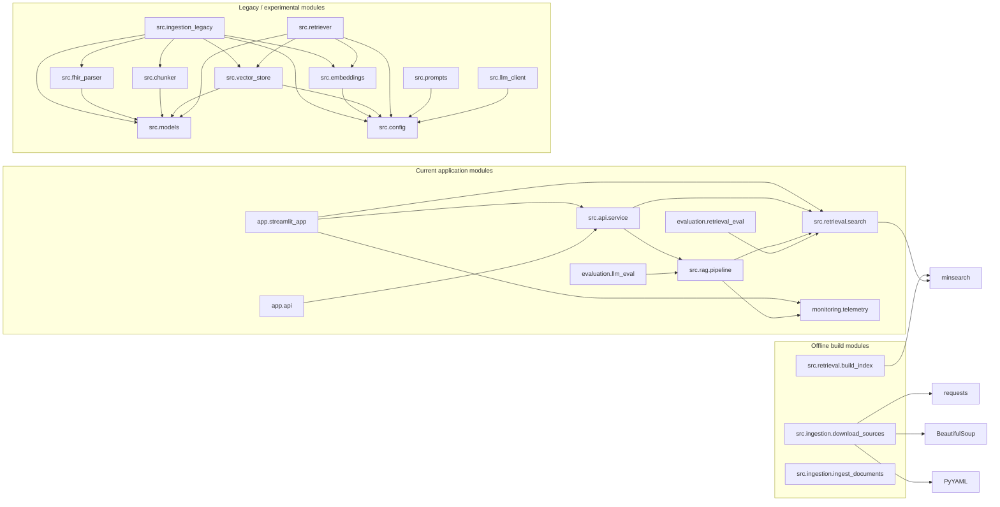
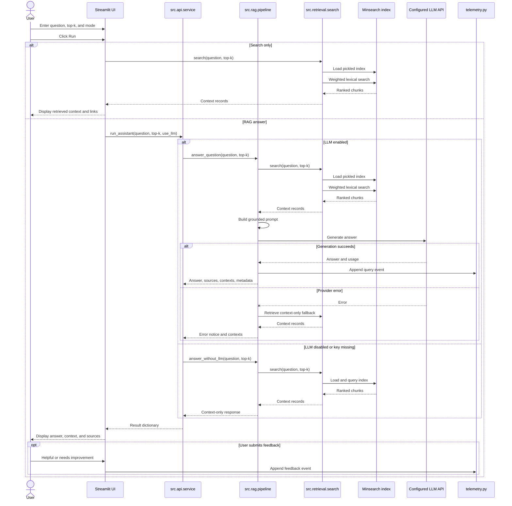

# Project Architecture

## Architectural Overview

The Precision Oncology Data Architect Assistant is a retrieval-augmented generation
(RAG) application for questions about FHIR R4, US Core, mCODE, and the Genomics
Reporting Implementation Guide.

The active application uses a lightweight lexical retrieval pipeline:

1. A YAML manifest identifies canonical public standards pages.
2. The ingestion commands download and clean those pages.
3. Clean text is split into overlapping chunks and stored as JSON Lines.
4. A Minsearch index is built and serialized to disk.
5. The FastAPI endpoint, Streamlit UI, or service interface retrieves relevant chunks.
6. The RAG pipeline sends the question and retrieved context to the configured LLM.
7. Query metadata and user feedback are appended to a local JSONL telemetry log.

The repository also contains a legacy/experimental semantic retrieval path for FHIR
JSON bundles. It parses bundles into typed models, creates embeddings, and stores
them in ChromaDB. That path is not called by the current FastAPI, Streamlit, or
service workflow.

## 1. Project Architecture Diagram



## 2. Module Dependency Diagram

Solid arrows below represent Python imports or direct calls in the current
application. The legacy branch is isolated from the active runtime.



## 3. Data Flow Diagram

```mermaid
flowchart LR
    subgraph BuildTime["Offline knowledge-base build"]
        A[Canonical source URLs<br/>source_manifest.yaml]
        B[HTTP download]
        C[Raw HTML]
        D[Clean plain text]
        E[Source metadata and checksums]
        F[Overlapping text chunks]
        G[JSONL chunk records]
        H[Minsearch fit]
        I[(Pickled search index)]

        A --> B
        B --> C
        C --> D
        B --> E
        D --> F
        E --> G
        F --> G
        G --> H
        H --> I
    end

    subgraph QueryTime["Runtime query flow"]
        Q[User question]
        Mode{Selected mode}
        Load[Load pickled index]
        Retrieve[Weighted lexical search<br/>source_name 1.5, content 1.0]
        Context[Top-k context chunks and source metadata]
        Key{LLM key available?}
        Prompt[System prompt + context + question]
        Generate[Provider LLM generation]
        Fallback[Context-only fallback]
        Result[Answer, contexts, sources,<br/>provider, model, usage]
        Display[Streamlit rendering or service response]
        QueryLog[(Query telemetry)]
        Feedback[Helpful / needs improvement]
        FeedbackLog[(Feedback telemetry)]

        Q --> Mode
        Mode -->|Search only| Load
        Mode -->|RAG answer| Load
        I --> Load
        Load --> Retrieve
        Q --> Retrieve
        Retrieve --> Context
        Context -->|Search only| Display
        Context --> Key
        Key -->|Yes| Prompt
        Q --> Prompt
        Prompt --> Generate
        Generate --> Result
        Key -->|No or generation error| Fallback
        Context --> Fallback
        Fallback --> Result
        Result --> Display
        Generate --> QueryLog
        Display --> Feedback
        Feedback --> FeedbackLog
    end
```



### Principal data contracts

| Artifact | Format | Producer | Consumer |
|---|---|---|---|
| `data/source_manifest.yaml` | YAML collections and source URLs | Maintainer | Source downloader |
| `data/raw/<collection>/*` | HTML, clean text, metadata JSON | Source downloader | Document ingestion |
| `data/processed/chunks.jsonl` | One searchable chunk per JSON line | Document ingestion | Index builder |
| `data/indexes/minsearch_index.pkl` | Pickled Minsearch index | Index builder | Runtime search |
| RAG result | Python dictionary | RAG pipeline | Service and Streamlit UI |
| `logs/queries.jsonl` | Append-only JSON events | Telemetry module | Local monitoring/review |

## 4. Folder Structure

Generated artifacts and representative data files are included because they are
part of the checked-in runtime. Cache directories and every individual downloaded
standards page are omitted for readability.

```text
.
├── app/
│   ├── __init__.py
│   ├── api.py                         # FastAPI endpoints
│   └── streamlit_app.py               # Interactive UI and feedback controls
├── data/
│   ├── evaluation_questions/
│   │   └── nsclc_questions.json
│   ├── fhir_examples/                 # Example FHIR bundles for legacy parsing
│   ├── indexes/
│   │   └── minsearch_index.pkl        # Active serialized retrieval index
│   ├── processed/
│   │   └── chunks.jsonl               # Active searchable chunk corpus
│   ├── raw/
│   │   ├── fhir_r4_core/
│   │   ├── genomics_reporting/
│   │   ├── mcode/
│   │   ├── us_core/
│   │   └── download_report.json
│   ├── sample/
│   └── source_manifest.yaml
├── docs/
│   ├── architecture.md                # Detailed architecture documentation
│   ├── clawbio_integration.md
│   ├── course_requirements.md
│   ├── data_sources.md
│   ├── evaluation.md
│   ├── monitoring.md
│   ├── REVIEWER_EVALUATION_GUIDE.md
│   └── rubric_scorecard.md
├── evaluation/
│   ├── ground_truth.csv
│   ├── llm_eval.py                    # Heuristic or LLM-as-judge evaluation
│   ├── questions.csv
│   └── retrieval_eval.py              # Recall@k, MRR, and nDCG evaluation
├── ingestion/
│   └── index_to_vectordb.py            # Compatibility entrypoint for index build
├── logs/
│   └── queries.jsonl                  # Local query and feedback events
├── monitoring/
│   └── telemetry.py
├── notebooks/                         # Reserved for analysis notebooks
├── prompts/
│   └── system_prompts.yaml            # Experimental reusable prompt templates
├── scripts/                           # Reserved for utility scripts
├── src/
│   ├── api/
│   │   └── service.py                 # Stable application-facing interface
│   ├── evaluation/                    # Thin wrappers around evaluation scripts
│   ├── ingestion/
│   │   ├── download_sources.py        # Manifest-driven downloader and cleaner
│   │   └── ingest_documents.py        # Active text chunking pipeline
│   ├── rag/
│   │   ├── pipeline.py                # Active RAG and provider routing
│   │   └── pipeline_openai_backup.py  # Earlier OpenAI-only implementation
│   ├── retrieval/
│   │   ├── build_index.py             # Active Minsearch index builder
│   │   └── search.py                  # Active runtime retrieval
│   ├── chunker.py                     # Legacy typed document chunking
│   ├── config.py                      # Legacy provider/vector settings
│   ├── embeddings.py                  # Legacy embedding abstraction
│   ├── fhir_parser.py                 # Legacy FHIR bundle parser
│   ├── ingestion_legacy.py            # Legacy semantic ingestion orchestration
│   ├── llm_client.py                  # Experimental multi-provider abstraction
│   ├── models.py                      # Pydantic domain models
│   ├── prompts.py                     # YAML prompt loader
│   ├── retriever.py                   # Legacy semantic retriever
│   └── vector_store.py                # Legacy ChromaDB abstraction
├── tests/
│   ├── test_api_connections.py
│   ├── test_chunker.py
│   ├── test_evaluation_files.py
│   ├── test_ingestion.py
│   ├── test_manifest.py
│   └── test_service_interface.py
├── .env.example
├── Dockerfile
├── docker-compose.yml
├── Makefile
├── README.md
└── requirements.txt
```

## 5. User Query Sequence Diagram



## 6. README Architecture Section

The following is the concise architecture section used in the project README:

> The application uses an offline ingestion pipeline and a lightweight runtime
> RAG pipeline. Canonical FHIR R4, US Core, mCODE, and Genomics Reporting pages
> are downloaded from a manifest, converted to clean text, split into overlapping
> JSONL chunks, and indexed with Minsearch. At runtime, the FastAPI endpoint,
> Streamlit UI, and reusable Python service retrieve top-ranked chunks and
> either return them directly or pass them to the configured Groq, OpenRouter,
> or OpenAI model.
> Queries and user feedback are recorded in a local append-only JSONL log.
>
> A separate legacy/experimental path supports parsing FHIR JSON bundles,
> embedding typed chunks, and storing them in ChromaDB; it is not used by the
> current FastAPI or Streamlit runtime.

## Implementation Notes

- The active retriever is lexical Minsearch, not the ChromaDB vector store.
- The active RAG provider router supports `groq`, `openrouter`, and `openai`.
- The Streamlit UI explicitly detects keys for all three active providers.
- `run_assistant(..., use_llm=None)` auto-enables generation when the selected
  provider has its required key configured.
- Runtime search reloads the pickled index for each search call.
- Successful LLM generations are logged; context-only fallbacks are not logged
  as query events by the RAG pipeline.
- The YAML prompt manager and generic `LLMClient` abstraction belong to the
  experimental architecture and are not imported by the active RAG pipeline.
- `ingestion/index_to_vectordb.py` is kept as a compatibility entrypoint for
  the documented index-build command.
